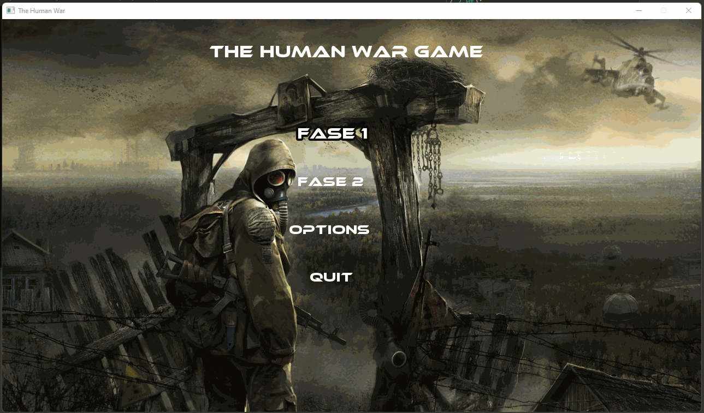

# Human War Game

**Academic project developed in C++ for the Programming Techniques course - UTFPR (1st semester of 2022).**

This project consists of a platform game simulating a battle between human units with movement, attack, and basic combat logic.

---

## Context

This was one of the first projects I developed during my Computer Engineering degree at UTFPR. It was uploaded to GitHub directly, before I started using Git properly. I keep this project public as part of my learning process and growth as a developer.

---


---

## Features

- Troop movement
- Character attacks
- Damage variations
- Graphical interface

---

## Technologies

- **Language:** C++
- **Libraries:** SFML
- **Recommended compiler:** g++ or MinGW
- **Suggested environment:** Linux terminal, Windows with Dev-C++ or VS Code

---

## How to run

1. Clone the repository:
   ```bash
   git clone https://github.com/pedrohdosanjos/human-war-game.git
   cd human-war-game
   cd sources
   ```

2. Run:
   ```bash
   docker compose up
   ```

---

## Notes

- Code written at the beginning of my degree — may contain non-ideal practices.
- No version control system was used during the original development.
- This project is kept public as part of my learning history.


